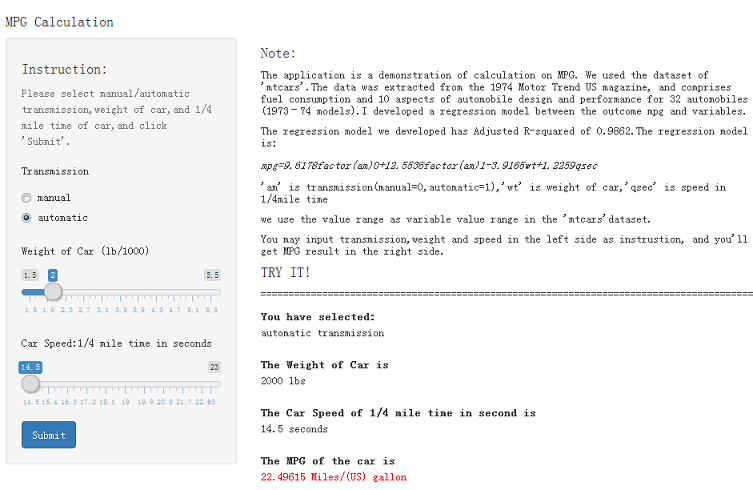

MPG Calculation 
========================================================

a demonstration of MPG calculation base on regression model


author      :Meng Xin

Fri Sep 25 14:50:25 2015


Develop Regression Model
========================================================
 * We used dataset"mtcars",fit and got the regression model on the relationship between mpg(mile per gallon)and transimission and other variables:

**mpg=9.6178factor(am)0+12.5536factor(am)1-3.9165wt+1.2259qsec**

 * 'am' is transmission(manual=0,automatic=1),'wt' is weight of car,'qsec' is speed in 1/4mile time.
 * we use  9.6178 when transmission is manual, and use 12.5536 when transmission is automatic.
 * We see the summary of the model in the next slide.Note the p-value is all<0.05.
 
Develop Regression Model
========================================================

```

Call:
lm(formula = mpg ~ factor(am) + wt + qsec - 1, data = mtcars)

Residuals:
    Min      1Q  Median      3Q     Max 
-3.4811 -1.5555 -0.7257  1.4110  4.6610 

Coefficients:
            Estimate Std. Error t value Pr(>|t|)    
factor(am)0   9.6178     6.9596   1.382 0.177915    
factor(am)1  12.5536     6.0573   2.072 0.047543 *  
wt           -3.9165     0.7112  -5.507 6.95e-06 ***
qsec          1.2259     0.2887   4.247 0.000216 ***
---
Signif. codes:  0 '***' 0.001 '**' 0.01 '*' 0.05 '.' 0.1 ' ' 1

Residual standard error: 2.459 on 28 degrees of freedom
Multiple R-squared:  0.9879,	Adjusted R-squared:  0.9862 
F-statistic: 573.7 on 4 and 28 DF,  p-value: < 2.2e-16
```

The Application 
========================================================
We develop an application by using the regression model to demonstrate mpg calculation.



The Application 
========================================================
[The application](https://maggiebj.shinyapps.io/shinyproject)
 is to calculate MPG when user input transmission, weight, speed of car and submit.The result of MPG is shown to the right in red.
 
You can also copy link: https://maggiebj.shinyapps.io/shinyproject

For some reasons, the application may can't be shown in the full screen in your browser, you may use scroll bar to the right to scroll and see it.


